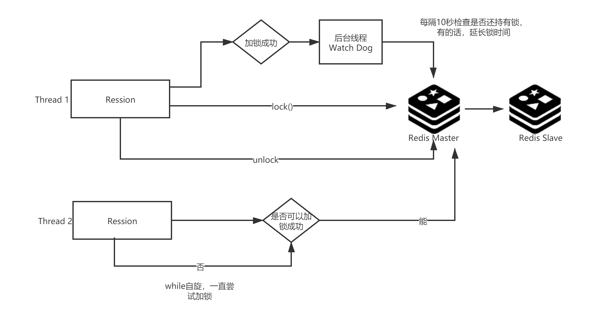

### 场景说明 
解决多进程同时访问Redis时造成的读写不一致问题


### 解决方案
**SET key value PX milliseconds NX**
将字符串值 value 关联到 key

`PX milliseconds ： 将键的过期时间设置为 milliseconds 毫秒`

`NX ： 只在键不存在时， 才对键进行设置操作`


### 注意事项
1. 每个线程只能解锁自己上的锁，因此加锁需设置随机字符串，并且在删除锁时判断字符串是否是自己生成的，只有自己生成的字符串，才能进行解锁操作；
2. 如果线程执行时间超过锁的过期时间，需要添加续锁操作：检查锁是否存在，如果还存在，则说明线程未执行完，则删除当前锁并重新设置锁的过期时间为初始过期时间；
3. 续锁操作必须在一个事务中进行，以保证删除和添加操作的原子性。可以通过官方推荐的lua脚本来做到
```lua
if redis.call('get', KEYS[1]) == ARGV[1] then 
  redis.call('del', KEYS[1]) 
end 
return redis.call('set', KEYS[1], ARGV[2], 'px', ARGV[3], 'nx')
```

### 示意图(以Java的Ression为例)


#### TODO
1. C++ Watch dog
2. Redis连接中断重连
3. 生成随机字符串的代码不能跨平台

